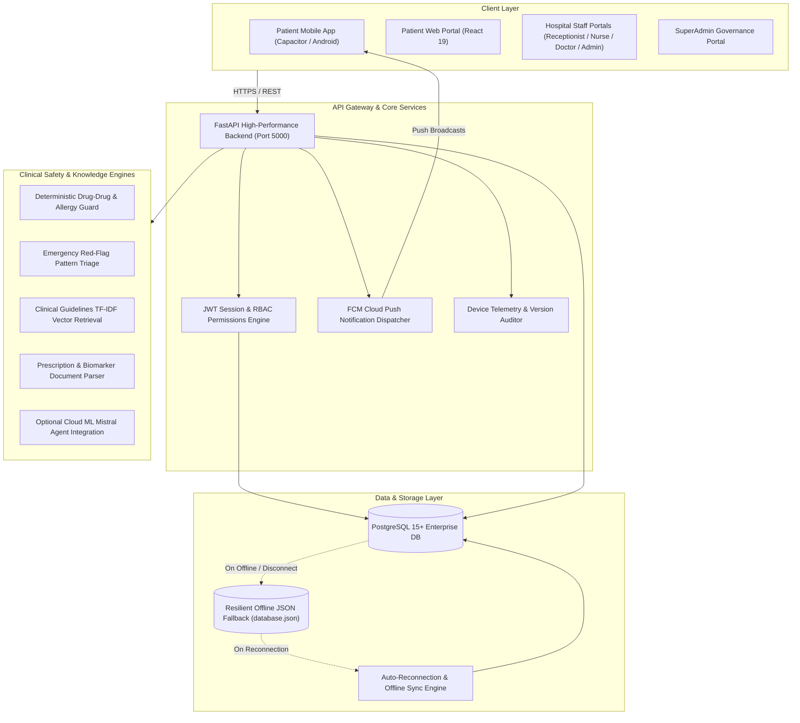

# CarePulse — Multi-Hospital Enterprise Clinical Operations & EMR Platform

[](https://github.com/Abinandhan-2007/S5_Mini_Project/actions/workflows/playwright.yml)
[](https://fastapi.tiangolo.com/)
[](https://react.dev/)
[](https://www.postgresql.org/)
[](https://capacitorjs.com/)

CarePulse is an enterprise-grade, multi-tenant hospital clinical operations platform and Electronic Medical Records (EMR) system. It seamlessly orchestrates clinical workflows across outpatient visits—from patient mobile booking, QR check-in, receptionist token allocation, and nurse vital triage to physician consultations, e-prescriptions, and hospital network governance.

---

## 🏛️ System Architecture



---

## 👥 Role Profiles & Permissions Matrix

The platform implements a strict 6-tier Role-Based Access Control (RBAC) model:

| Role | Scope | Key Capabilities & Workflows | Portal Route |
| :--- | :--- | :--- | :--- |
| **Patient** | Personal & Family | Doctor directory lookup, appointment booking, digital OP token, consultation history, prescription review, medicine info scanner, and 4-language i18n support. | `/home`, `/book`, `/history` |
| **Receptionist** | Facility Level | OP token generation, walk-in patient check-in, real-time doctor room queue allocation, and token slip printing. | `/staff/receptionist` |
| **Nurse** | Facility Level | Patient QR code check-in scanner, pre-consultation vitals entry (BP, Heart Rate, Temp, SpO2, Weight, BMI), and clinical triage tagging. | `/staff/nurse` |
| **Doctor** | Consultation Room | Real-time assigned patient queue, past medical history review, vital trend charts, ICD-10 diagnosis entry, e-prescriptions, and consultation finalization. | `/staff/doctor` |
| **Hospital Admin** | Individual Hospital | Hospital facility profile, doctor duty schedules, staff account provisioning, and departmental analytics. | `/staff/admin` |
| **Platform SuperAdmin** | Network / Root Level | Multi-hospital registry, facility lifecycle governance, administrator assignment, live device telemetry (`patient_devices`), app version compliance audit, and platform audit logging. | `/staff/superadmin` |

---

## 🧠 AI Module & Clinical Safety Architecture (Verified Baseline)

CarePulse prioritizes patient safety and operational transparency. In production environments where external LLM access may be unavailable or cost-constrained, the core safety architecture runs **100% deterministically**:

```
                                  Patient Intake / Prescriptions
                                                │
                 ┌──────────────────────────────┼──────────────────────────────┐
                 ▼                              ▼                              ▼
    ┌─────────────────────────┐   ┌───────────────────────────┐   ┌─────────────────────────┐
    │  Emergency Triage Agent │   │      Drug Guard Engine    │   │   Clinical RAG Engine   │
    │ ----------------------- │   │ ------------------------- │   │ ----------------------- │
    │ Regex Pattern Matcher   │   │ Registry Table Matching   │   │ Scikit-Learn TF-IDF     │
    │ Acute Red-Flag Traps    │   │ Contraindications & Alert │   │ Cosine Similarity       │
    │ 100% Zero-Latency       │   │ Clinical Pharmacopeia     │   │ Local Guideline Docs    │
    └─────────────────────────┘   └───────────────────────────┘   └─────────────────────────┘
                 │                              │                              │
                 └──────────────────────────────┼──────────────────────────────┘
                                                ▼
                         Optional Cloud ML Mistral Agent API Hook
                         (Activated when MISTRAL_API_KEY is supplied)
```

1. **Deterministic Drug Guard Engine (`drug_guard.py`)**:
   - Cross-references proposed prescriptions against the patient’s documented allergies and active medications.
   - Evaluates high-risk contraindications (e.g., NSAID + ACE Inhibitor acute kidney injury, NSAID + Anticoagulant gastrointestinal bleeding, Statin + Azole antifungal myopathy) with zero external network dependencies.
2. **Deterministic Emergency Triage (`triage.py`)**:
   - Evaluates symptoms against validated acute patterns (e.g., crushing chest pain, acute dyspnea, stroke indicators) with negation awareness (`no shortness of breath` is safely excluded). Immediately issues emergency redirection guidance.
3. **Clinical Guideline RAG (`rag.py`)**:
   - Uses Scikit-Learn's `TfidfVectorizer` and cosine similarity vector-space ranking across indexed clinical protocols. Requires no external vector database.
4. **Document & Vision Parser (`vision_parser.py`)**:
   - Extracts medications and lab biomarkers from text and OCR. When `MISTRAL_API_KEY` is provided, leverages Cloud ML Mistral Vision (`pixtral-12b-2409`); otherwise falls back gracefully to a deterministic regex parser.
5. **Conversational Engine (`llm.py`)**:
   - Integrates with Cloud ML Mistral Agent API (`ag_01a062cbadc977cf85c1546ff60ad68e`). When unconfigured, returns an informative service availability notice rather than hallucinating.
6. **Ambient Voice Scribe Status**:
   - The experimental live-microphone consultation scribe was archived to branch `feature/ambient-voice-scribe-shelved`. The `main` branch includes a deterministic transcript parser (`voice_scribe.py`) for existing consultation text.

---

## 🛠️ Technology Stack

* **Backend**: Python 3.11+, FastAPI, Uvicorn, Psycopg 3, Pydantic v2, Scikit-Learn, Firebase Admin SDK.
* **Frontend**: React 19, TypeScript, Vite, Tailwind CSS v4, Lucide Icons, QR Scanner.
* **Database**: PostgreSQL 15+ with automatic schema migrations and fail-fast fallback to `database.json`.
* **Mobile**: Capacitor v7 with native Android bridge, FCM push notifications, and in-app update checks.
* **Testing & CI**: Playwright E2E, Python Unittest, GitHub Actions.

---

## 🚀 Setup & Installation Guide

### 1. Prerequisites
* **Node.js**: v20.x or later
* **Python**: v3.11 or later
* **PostgreSQL**: v15 or later (running on port `5432`)
* **Android Studio & SDK**: (Optional, for mobile APK builds)

### 2. Database Initialization
Create the database in PostgreSQL (via pgAdmin or psql):
```sql
CREATE DATABASE carepulse_db;
CREATE USER carepulse_user WITH PASSWORD 'carepulse_pass';
GRANT ALL PRIVILEGES ON DATABASE carepulse_db TO carepulse_user;
```
The backend automatically executes migrations on startup. To manually inspect schema definitions, refer to `backend/database/init.sql`.

### 3. Environment Configuration (`.env`)
Create a `.env` file in the root directory by copying `.env.example`:
```bash
cp .env.example .env
```

| Variable | Description | Example |
| :--- | :--- | :--- |
| `DB_USER` | PostgreSQL username | `carepulse_user` |
| `DB_PASSWORD` | PostgreSQL password | `carepulse_pass` |
| `DB_DATABASE` | PostgreSQL database name | `carepulse_db` |
| `DB_HOST` | PostgreSQL host | `localhost` |
| `DB_PORT` | PostgreSQL port | `5432` |
| `ALLOW_JSON_FALLBACK` | Allow local JSON store when DB is offline | `true` |
| `JWT_SECRET` | Secret key for JWT signing | `your-secure-jwt-secret` |
| `ALGORITHM` | JWT hashing algorithm | `HS256` |
| `FIREBASE_CREDENTIALS_PATH` | Path to Firebase serviceAccountKey.json | `backend/serviceAccountKey.json` |
| `MISTRAL_API_KEY` | *(Optional)* Mistral Cloud ML API Key | `your_mistral_key` |
| `MISTRAL_AGENT_ID` | *(Optional)* Custom Mistral Agent ID | `ag_01a062cbadc977cf85c1546ff60ad68e` |

### 4. Backend Setup
```bash
# From repository root
cd backend
python -m venv .venv
# Windows:
.venv\Scripts\activate
# Linux/macOS:
source .venv/bin/activate

pip install -r requirements.txt
python main.py
```
*Backend runs on:* `http://localhost:5000` (Swagger docs: `http://localhost:5000/docs`)

### 5. Frontend Setup
```bash
cd frontend
npm install
npm run dev
```
*Frontend runs on:* `http://localhost:5173`

### 6. One-Click Batch Launchers (Windows)
* Development Server: `start-carepulse-dev.bat`
* Production Mode: `start-carepulse.bat`
* Stop All Services: `stop-carepulse.bat`

---

## 📱 Mobile APK Build & In-App Updates

CarePulse features an automated end-to-end APK compilation and push update pipeline:

### Build and Deploy Update:
```bash
# Build frontend, sync Capacitor, compile Gradle debug APK, deploy to static downloads, and broadcast FCM alert:
python backend/deploy_update.py --bump patch --notes "CarePulse stability updates and performance optimizations."
```
* **Target Output**: `CarePulse_App.apk` (root) and `backend/static_downloads/CarePulse_App.apk`.
* **Version Registry**: Synchronized automatically in `backend/app_version.json` and `frontend/android/app/build.gradle`.
* **Telemetry Tracking**: SuperAdmins can monitor live version adoption (`v1.9.29` vs older) in real-time on the **App & Device Registry** portal.

---

## 🧪 Automated Testing

### Playwright End-to-End Tests
```bash
# Run all end-to-end suites headlessly:
npx playwright test

# Run specific portal suites:
npx playwright test tests/staff/doctor-queue.spec.ts
npx playwright test tests/staff/nurse-vitals.spec.ts
npx playwright test tests/staff/receptionist-token.spec.ts
npx playwright test tests/patient/book-appointment.spec.ts
```

### Backend Integration & Schema Tests
```bash
python -m unittest backend/tests/test_routes.py
python -m unittest backend/tests/test_db_schema.py
python -m unittest backend/tests/test_patient_devices.py
```

---

## 🌐 Internationalization (i18n)

The patient portal supports four languages:
* 🇬🇧 **English (`en`)**
* 🇮🇳 **Tamil (`ta`)**
* 🇮🇳 **Malayalam (`ml`)**
* 🇮🇳 **Hindi (`hi`)**

Language selection is accessible via the patient header profile modal (`LanguageSelectModal`) and persisted across sessions in `localStorage`. Per clinical governance standards, staff portals remain in English.

---

## 📋 Key API Endpoints Directory

| Category | Method | Endpoint | Description |
| :--- | :--- | :--- | :--- |
| **Auth** | `POST` | `/api/auth/login` | Staff and doctor authentication |
| **Auth** | `POST` | `/api/patient/auth/login` | Patient authentication / phone login |
| **SuperAdmin** | `POST` | `/api/superadmin/login` | SuperAdmin master login |
| **SuperAdmin** | `GET` | `/api/superadmin/stats` | Network-wide platform overview |
| **SuperAdmin** | `GET` | `/api/superadmin/devices` | Real-time device telemetry & version adoption |
| **SuperAdmin** | `DELETE`| `/api/superadmin/devices/{id}` | Revoke device authentication session |
| **Staff** | `GET` | `/api/staff/doctor/queue` | Doctor's active patient queue |
| **Staff** | `POST` | `/api/staff/nurse/vitals` | Nurse vital signs recording |
| **Staff** | `POST` | `/api/staff/receptionist/token` | Walk-in OP token generation |
| **Patients** | `POST` | `/api/patient/device-info` | Telemetry registration on mobile launch |
| **Patients** | `POST` | `/api/patient/device-token` | FCM push token registration |
| **AI Services** | `POST` | `/api/ai/triage` | Emergency symptom assessment |
| **AI Services** | `POST` | `/api/ai/drug-guard` | Drug-drug interaction & allergy cross-check |
| **AI Services** | `POST` | `/api/ai/rag` | Clinical guideline protocol lookup |
| **AI Services** | `POST` | `/api/ai/vision-parser` | Medical document & lab report extraction |
| **AI Services** | `POST` | `/api/ai/chat` | Clinical assistant conversational intake |
| **App Updates** | `GET` | `/api/app-version` | In-app version detection check |

---

## 📄 License & Academic Note
Developed as part of the S5 Mini Project Curriculum. CarePulse is intended for healthcare educational and administrative demonstration purposes.
