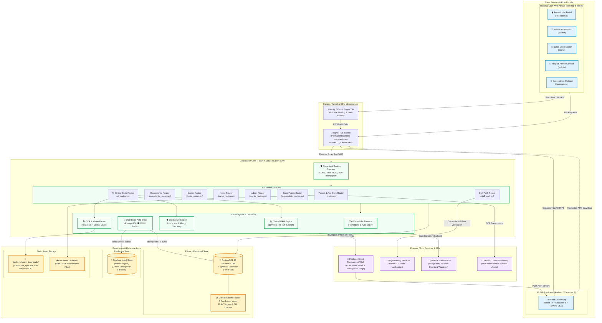

# 🏥 CarePulse — System Overview & Architecture

> **Document Version:** 1.0.0  
> **Classification:** Comprehensive Technical Reference / System Review Report  
> **Last Updated:** 2026-09-10  
> **Scope:** Full-Stack HealthTech Platform (Web, Android APK, Micro-Services Backend, Multi-Hospital Portals)

---

## 1.1 Executive Summary & Full Project Name

**Full Project Name:**  
**CarePulse — Smart Multi-Hospital Management, Intelligent Clinical Triage & Patient Health Assistant Platform**

CarePulse is an enterprise-grade, omnichannel hospital information and patient management system designed to eliminate structural inefficiencies in outpatient healthcare delivery. Built using modern web and mobile primitives (React 19, TypeScript 5+, Vite, Tailwind CSS, Capacitor 8, FastAPI, PostgreSQL with pgvector, and mistral-based clinical AI), CarePulse unifies six discrete stakeholders into a synchronized clinical pipeline:
1. **Outpatients & Families** (via native Android APK and responsive web app)
2. **Hospital Receptionists & Front-Desk Staff** (via the Receptionist Token & Queue Portal)
3. **Primary Care Physicians & Specialists** (via the Doctor Consultation & EMR Suite)
4. **Triage Nurses & Phlebotomists** (via the Nurse Pre-Consultation Vitals & Lab Testing Station)
5. **Hospital Administrators** (via the Multi-Department Executive Admin Console)
6. **Platform SuperAdministrators** (via the Multi-Hospital Governance & Audit Control Center)

---

## 1.2 Problem Statement

In contemporary outpatient clinical practice—particularly across developing and emerging healthcare ecosystems such as India—the primary hospital encounter remains afflicted by friction points across four distinct operational layers:

```
[ Traditional Outpatient Friction Points ]
       │
       ├── 1. Fragmented Scheduling & Physical Token Bottlenecks
       │      Patients arrive without appointment visibility or wait hours in crowded reception
       │      areas with static paper tokens, creating volatile waiting-room surges.
       │
       ├── 2. Disjointed Clinical Record Continuity
       │      Paper prescriptions and handwritten vitals get lost between visits; doctors lack
       │      immediate historical timeline visibility during 3-to-5 minute consults.
       │
       ├── 3. Dangerous Medication Misunderstandings & Drug Adverse Interactions
       │      Patients struggle to read handwritten dosages, take medications at incorrect
       │      intervals (with/without food), or accidentally consume contraindicated drugs.
       │
       └── 4. Multi-Tenant Operational & Network Vulnerabilities
              Rural and semi-urban clinics suffer periodic broadband dropouts; standard cloud-only
              hospital software crashes or blocks admissions whenever connectivity blinks.
```

### CarePulse Direct Interventions:
- **Unified Hybrid Queueing Engine:** Reconciles scheduled online reservations with unexpected emergency and walk-in arrivals via dynamic priority interleaving (scheduled-priority hybrid).
- **Two-Way Real-Time Prescription Sync:** Physician-entered digital SOAP prescriptions instantaneously reflect on the patient’s Android mobile device with active dosage schedules and automated alarm notifications.
- **Computer Vision & Packaging Guard:** Patients can capture medicine strips with their phone camera to instantly run OCR + fuzzy string matching + contraindication checking against active allergies.
- **Fail-Fast Dual-Store Resilience:** The platform operates natively on PostgreSQL with pgvector, while transparently retaining offline JSON fallback buffers and an automatic re-sync daemon that protects terminal clinical records upon reconnect.

---

## 1.3 Target Users & System Roles

| Role Name | Access Mechanism | Primary Operational Objectives |
| :--- | :--- | :--- |
| **Patient** | Android Native App / Mobile Web (`/`, `/home`) | Instant clinic discovery, slot booking, AI symptom triage, live queue tracking, digital prescriptions, medicine scanner, intake alarms. |
| **Receptionist** | Desktop Web Portal (`/receptionist`) | Desk token dispatch, walk-in patient triage, emergency slot overrides, real-time doctor availability monitor, queue calling. |
| **Doctor** | Clinic Tablet / Desktop (`/doctor`) | Live waiting room queue, pre-consultation vitals inspection, SOAP clinical documentation, structured Rx issuing, EMR history timeline. |
| **Nurse** | Ward / Triage Station (`/nurse`) | Pre-consultation vitals logging (BP, HR, SpO2, Temp, Glucose, BMI), diagnostic test order execution, lab report PDF attachments. |
| **Hospital Admin** | Hospital Admin Console (`/admin`) | Hospital department configuration, staff roster generation (Doctors, Nurses, Receptionists), capacity limits, shift audits. |
| **SuperAdmin** | Global Platform Console (`/superadmin`) | Multi-hospital onboarding, hospital lifecycle controls, administrator credential provisioning, cross-facility audit trails. |

---

## 1.4 High-Level End-to-End System Architecture

The following Mermaid architectural diagram details the network topography, container boundaries, security gateways, and communication protocols interconnecting every component of CarePulse:


