# 🗄️ CarePulse — Complete Database Schema & Entity-Relationship Reference

> **Document Version:** 1.0.0  
> **Classification:** Database Architecture & Physical Data Model Specification  
> **Last Updated:** 2026-09-10  
> **Scope:** Complete PostgreSQL 18 Schema (`database/init.sql`), Migrations, Views, Functions & Indexes

---

## 4.1 Master Entity-Relationship (ER) Diagram

The following Mermaid diagram reflects the active, verified physical database schema implemented across CarePulse:

```mermaid
erDiagram
    HOSPITALS ||--o{ STAFF : "employs"
    HOSPITALS ||--o{ DOCTORS : "contracts"
    HOSPITALS ||--o{ APPOINTMENTS : "hosts"
    HOSPITALS ||--o{ RECEPTIONIST_DESKS : "operates"
    HOSPITALS ||--o{ CONSULTATIONS : "records"
    
    PATIENTS ||--o{ APPOINTMENTS : "books"
    PATIENTS ||--o{ CONSULTATIONS : "attends"
    PATIENTS ||--o{ PRESCRIPTIONS : "receives"
    PATIENTS ||--o| EMERGENCY_CONTACTS : "designates"
    PATIENTS ||--o{ DEVICE_TOKENS : "registers"
    PATIENTS ||--o{ NOTIFICATION_LOG : "receives"
    PATIENTS ||--o{ VITALS : "submits"
    PATIENTS ||--o{ LAB_TESTS : "undergoes"

    DOCTORS ||--o{ APPOINTMENTS : "conducts"
    DOCTORS ||--o{ CONSULTATIONS : "documents"
    DOCTORS ||--o| STAFF : "mapped to staff account"

    APPOINTMENTS ||--o{ VITALS : "assessed in"
    APPOINTMENTS ||--o{ LAB_TESTS : "ordered in"

    STAFF ||--o{ OPERATIONS_LOG : "authorizes"
    STAFF ||--o{ RECEPTIONIST_DESKS : "assigned to"
    STAFF ||--o{ VITALS : "records"
    STAFF ||--o{ LAB_TESTS : "orders/records"

    HOSPITALS {
        varchar id PK
        varchar hospital_code UK "Trigger H001, H002"
        varchar name
        text address
        varchar phone
        decimal rating
        int reviews_count
        boolean emergency_available
        text image_url
        jsonb specialties
        varchar facility_type
        decimal distance_miles
        boolean is_active
        varchar email
        timestamptz created_at
    }

    PATIENTS {
        uuid id PK "gen_random_uuid()"
        varchar patient_code UK "Trigger P000001, P000002"
        varchar full_name
        varchar email UK
        varchar phone
        date dob
        varchar gender
        varchar blood_group
        text avatar_url
        varchar google_id UK
        varchar auth_provider
        varchar password_hash
        text address
        text allergies
        text pre_existing_conditions
        jsonb emergency_contact
        timestamptz created_at
    }

    STAFF {
        uuid id PK "gen_random_uuid()"
        varchar staff_code UK "Trigger <Role><Hosp><Seq>"
        varchar full_name
        varchar email UK
        varchar username
        varchar password_hash
        varchar google_id UK
        varchar auth_provider
        varchar role "CHECK (superadmin, admin, receptionist, doctor, nurse)"
        varchar specialization
        varchar phone
        text avatar_url
        varchar hospital_id FK "hospitals(id)"
        varchar doctor_id FK "doctors(id)"
        uuid created_by FK "staff(id)"
        boolean is_active
        timestamptz last_login_at
        timestamptz created_at
    }

    DOCTORS {
        varchar id PK
        varchar name
        varchar specialty
        varchar department
        varchar hospital_id FK "hospitals(id)"
        varchar hospital_name
        int experience_years
        decimal consultation_fee
        varchar phone
        varchar email
        varchar room_number
        boolean is_available
        varchar availability_reason
        varchar unavailable_until
        text photo
        decimal rating
        int reviews_count
        text about
        jsonb available_days
        jsonb slot_capacities
        timestamptz created_at
    }

    APPOINTMENTS {
        uuid id PK "gen_random_uuid()"
        uuid patient_id FK "patients(id)"
        varchar ticket_number
        varchar doctor_id
        varchar doctor_name
        varchar doctor_specialty
        text doctor_photo
        varchar hospital_id FK "hospitals(id)"
        varchar hospital_name
        date date
        varchar time_slot
        varchar type
        varchar status
        boolean is_checked_in
        timestamptz checked_in_at
        varchar check_in_time
        timestamptz created_at
    }

    CONSULTATIONS {
        uuid id PK "gen_random_uuid()"
        uuid patient_id FK "patients(id)"
        varchar doctor_id
        varchar doctor_name
        varchar hospital_id FK "hospitals(id)"
        date date
        jsonb soap_data
        timestamptz created_at
    }

    PRESCRIPTIONS {
        uuid id PK "gen_random_uuid()"
        uuid patient_id FK "patients(id)"
        varchar drug_name
        varchar dosage
        varchar frequency
        varchar meal_timing
        varchar prescriber
        varchar icon_type
        varchar status
        timestamptz created_at
    }

    EMERGENCY_CONTACTS {
        uuid id PK "gen_random_uuid()"
        uuid patient_id UK, FK "patients(id)"
        varchar name
        varchar phone
        varchar relationship
        timestamptz created_at
    }

    RECEPTIONIST_DESKS {
        uuid id PK "gen_random_uuid()"
        varchar hospital_id FK "hospitals(id)"
        varchar desk_number
        uuid assigned_staff_id FK "staff(id)"
        boolean is_active
        timestamptz created_at
    }

    OPERATIONS_LOG {
        uuid id PK "gen_random_uuid()"
        uuid staff_id FK "staff(id)"
        varchar staff_name
        varchar operation
        text description
        varchar entity_type
        uuid entity_id
        timestamptz created_at
    }

    PASSWORD_RESET_OTPS {
        serial id PK
        text firebase_uid
        text otp_hash
        timestamp expires_at
        integer attempts
        boolean used
        timestamp created_at
    }

    DEVICE_TOKENS {
        uuid id PK "gen_random_uuid()"
        uuid patient_id FK "patients(id)"
        text fcm_token
        varchar platform
        boolean is_active
        timestamptz created_at
        timestamptz updated_at
    }

    NOTIFICATION_LOG {
        uuid id PK "gen_random_uuid()"
        uuid patient_id FK "patients(id)"
        varchar notification_type
        uuid reference_id
        timestamptz sent_at
    }

    MEDICINES {
        varchar id PK
        varchar name
        varchar generic_name
        jsonb brand_names
        varchar dosage_form
        jsonb strengths
        varchar category
        text purpose
        timestamptz created_at
    }

    VITALS {
        uuid id PK "gen_random_uuid()"
        uuid appointment_id FK "appointments(id)"
        uuid patient_id FK "patients(id)"
        numeric height_cm
        numeric weight_kg
        numeric bmi "GENERATED ALWAYS AS (ROUND(weight/(height/100)^2, 1))"
        integer bp_systolic
        integer bp_diastolic
        integer heart_rate
        numeric temperature
        varchar temperature_unit
        integer respiratory_rate
        integer spo2
        numeric blood_glucose
        varchar glucose_context
        text notes
        uuid recorded_by FK "staff(id)"
        timestamptz recorded_at
    }

    LAB_TESTS {
        uuid id PK "gen_random_uuid()"
        uuid appointment_id FK "appointments(id)"
        uuid patient_id FK "patients(id)"
        varchar test_type
        jsonb structured_results
        text free_text_result
        text file_url
        varchar status
        uuid ordered_by FK "staff(id)"
        uuid recorded_by FK "staff(id)"
        timestamptz recorded_at
    }
```



---

## 4.2 Comprehensive Table Specifications

### 1. `patients`
- **Purpose:** Central entity for all registered outpatients. Stores cryptographic authentication credentials, demographic profiles, medical baseline data (blood group, known allergies, pre-existing conditions), and auto-generated display codes (`P000001`).
- **Columns:**
  - `id` (UUID, Primary Key, Default: `gen_random_uuid()`)
  - `patient_code` (VARCHAR(20), Unique, Auto-generated via trigger)
  - `full_name` (VARCHAR(255), Not Null)
  - `email` (VARCHAR(255), Unique, Not Null)
  - `phone` (VARCHAR(50), Default: `''`)
  - `dob` (DATE, Default: `CURRENT_DATE`)
  - `gender` (VARCHAR(50), Default: `'Not specified'`)
  - `blood_group` (VARCHAR(10), Default: `'O+'`)
  - `avatar_url` (TEXT, Default: `''`)
  - `google_id` (VARCHAR(255), Unique, Nullable)
  - `auth_provider` (VARCHAR(50), Default: `'local'`) — `'local'`, `'google'`, or `'online'`
  - `password_hash` (VARCHAR(255), Nullable) — Salted bcrypt hash
  - `address` (TEXT, Default: `''`)
  - `allergies` (TEXT, Default: `''`) — Comma-separated list cross-referenced by DrugGuard
  - `pre_existing_conditions` (TEXT, Default: `''`)
  - `emergency_contact` (JSONB, Default: `'{}'::jsonb`)
  - `created_at` (TIMESTAMPTZ, Default: `CURRENT_TIMESTAMP`)
- **Indexes:** Primary key index on `id`, unique index on `email`, unique index on `patient_code`.

### 2. `hospitals`
- **Purpose:** Multi-tenant medical facilities registered on CarePulse. Defines clinical specialties, physical address, emergency status, and auto-generated facility codes (`H001`, `H002`).
- **Columns:**
  - `id` (VARCHAR(100), Primary Key) — String identifier (e.g. `'hosp-1'`)
  - `hospital_code` (VARCHAR(20), Unique, Auto-generated via trigger)
  - `name` (VARCHAR(255), Not Null)
  - `address` (TEXT, Not Null)
  - `phone` (VARCHAR(50))
  - `rating` (DECIMAL(3, 1), Default: `4.8`)
  - `reviews_count` (INT, Default: `1500`)
  - `emergency_available` (BOOLEAN, Default: `TRUE`)
  - `image_url` (TEXT)
  - `specialties` (JSONB, Default: `'["General", "Emergency Care"]'::jsonb`)
  - `facility_type` (VARCHAR(100), Default: `'General'`)
  - `distance_miles` (DECIMAL(4, 1), Default: `1.0`)
  - `is_active` (BOOLEAN, Default: `TRUE`)
  - `email` (VARCHAR(255))
  - `created_at` (TIMESTAMPTZ, Default: `CURRENT_TIMESTAMP`)
- **Indexes:** Primary key index on `id`, unique index on `hospital_code`.

### 3. `doctors`
- **Purpose:** Physician and specialist registry. Maintains cabin locations, consultation fees, experience, weekly working days, and capacity allocations per time slot.
- **Columns:**
  - `id` (VARCHAR(100), Primary Key)
  - `name` (VARCHAR(255), Not Null)
  - `specialty` (VARCHAR(255), Not Null)
  - `department` (VARCHAR(255), Default: `'General Medicine'`)
  - `hospital_id` (VARCHAR(100), References `hospitals(id)`)
  - `hospital_name` (VARCHAR(255))
  - `experience_years` (INT, Default: `5`)
  - `consultation_fee` (DECIMAL(10, 2), Default: `500.00`)
  - `phone` (VARCHAR(50))
  - `email` (VARCHAR(255))
  - `room_number` (VARCHAR(100)) — Cabin location (e.g., `'Cabin 102 - 1st Floor'`)
  - `is_available` (BOOLEAN, Default: `TRUE`) — Real-time clinic presence toggle
  - `availability_reason` (VARCHAR(255), Default: `''`) — (e.g. `'In Emergency'`, `'On Lunch Break'`)
  - `unavailable_until` (VARCHAR(100), Default: `''`)
  - `photo` (TEXT)
  - `rating` (DECIMAL(3, 1), Default: `4.8`)
  - `reviews_count` (INT, Default: `85`)
  - `about` (TEXT)
  - `available_days` (JSONB, Default: `'["Mon", "Tue", "Wed", "Thu", "Fri"]'::jsonb`)
  - `slot_capacities` (JSONB, Default: `'[]'::jsonb`) — Configured seat ratios per time block
  - `created_at` (TIMESTAMPTZ, Default: `CURRENT_TIMESTAMP`)

### 4. `staff`
- **Purpose:** Secure internal user accounts for hospital employees across all five internal roles (`superadmin`, `admin`, `receptionist`, `doctor`, `nurse`). Enforces hierarchical staff codes and strict multi-tenant isolation.
- **Columns:**
  - `id` (UUID, Primary Key, Default: `gen_random_uuid()`)
  - `staff_code` (VARCHAR(20), Unique, Auto-generated via trigger)
  - `full_name` (VARCHAR(255), Not Null)
  - `email` (VARCHAR(255), Unique, Not Null)
  - `username` (VARCHAR(255))
  - `password_hash` (VARCHAR(255)) — Salted bcrypt hash
  - `google_id` (VARCHAR(255), Unique)
  - `auth_provider` (VARCHAR(50), Default: `'local'`)
  - `role` (VARCHAR(50), Not Null, CHECK constraint: `role IN ('superadmin', 'admin', 'receptionist', 'doctor', 'nurse')`)
  - `specialization` (VARCHAR(255))
  - `phone` (VARCHAR(50), Default: `''`)
  - `avatar_url` (TEXT, Default: `''`)
  - `hospital_id` (VARCHAR(100), References `hospitals(id)` ON DELETE SET NULL)
  - `doctor_id` (VARCHAR(100), References `doctors(id)` ON DELETE SET NULL)
  - `created_by` (UUID, References `staff(id)`)
  - `is_active` (BOOLEAN, Default: `TRUE`)
  - `last_login_at` (TIMESTAMPTZ)
  - `created_at` (TIMESTAMPTZ, Default: `CURRENT_TIMESTAMP`)
- **Constraints & Indexes:**
  - `idx_staff_email` on `staff(email)`
  - `idx_staff_role` on `staff(role)`
  - `idx_one_active_admin_per_hospital` (Unique partial index: `UNIQUE (hospital_id) WHERE role = 'admin' AND is_active = true`)

### 5. `appointments`
- **Purpose:** Core outpatient visit records. Connects patients, doctors, and hospitals. Manages check-in states, queue ticket numbers (`#CP-4821`), and appointment status transitions.
- **Columns:**
  - `id` (UUID, Primary Key, Default: `gen_random_uuid()`)
  - `patient_id` (UUID, References `patients(id)` ON DELETE CASCADE)
  - `ticket_number` (VARCHAR(50), Not Null)
  - `doctor_id` (VARCHAR(100), Not Null)
  - `doctor_name` (VARCHAR(255), Not Null)
  - `doctor_specialty` (VARCHAR(255), Default: `'General Medicine'`)
  - `doctor_photo` (TEXT, Default: `''`)
  - `hospital_id` (VARCHAR(100), References `hospitals(id)`)
  - `hospital_name` (VARCHAR(255), Default: `'CarePulse Central Hospital'`)
  - `date` (DATE, Not Null)
  - `time_slot` (VARCHAR(50), Not Null)
  - `type` (VARCHAR(50), Default: `'In-Person'`) — `'In-Person'` or `'Walk-In'`
  - `status` (VARCHAR(50), Default: `'Upcoming'`) — `'Upcoming'`, `'Confirmed'`, `'Checked In'`, `'Waiting'`, `'In Consultation'`, `'Completed'`, `'Cancelled'`
  - `is_checked_in` (BOOLEAN, Default: `FALSE`)
  - `checked_in_at` (TIMESTAMPTZ, Default: `NULL`)
  - `check_in_time` (VARCHAR(50))
  - `created_at` (TIMESTAMPTZ, Default: `CURRENT_TIMESTAMP`)
- **Indexes:**
  - `idx_appointments_patient_id` on `appointments(patient_id)`
  - `idx_appointments_date` on `appointments(date)`
  - `idx_appointments_hospital_id` on `appointments(hospital_id)`
  - `idx_appointments_is_checked_in` on `appointments(is_checked_in)`

### 6. `consultations`
- **Purpose:** Clinical consultation encounters documented by physicians. Stores full SOAP (Subjective, Objective, Assessment, Plan) records inside a queryable JSONB column.
- **Columns:**
  - `id` (UUID, Primary Key, Default: `gen_random_uuid()`)
  - `patient_id` (UUID, References `patients(id)` ON DELETE CASCADE)
  - `doctor_id` (VARCHAR(100), Not Null)
  - `doctor_name` (VARCHAR(255), Not Null)
  - `hospital_id` (VARCHAR(100), References `hospitals(id)`)
  - `date` (DATE, Not Null)
  - `soap_data` (JSONB, Not Null, Default: `'{}'::jsonb`) — Structure: `{ subjective, objective, assessment, plan, vitals }`
  - `created_at` (TIMESTAMPTZ, Default: `CURRENT_TIMESTAMP`)
- **Indexes:**
  - `idx_consultations_soap_data` (GIN index on `soap_data`)
  - `idx_consultations_hospital_id` on `consultations(hospital_id)`

### 7. `prescriptions`
- **Purpose:** Granular medication records prescribed during consultations. Syncs directly to patient devices and powers intake notification alarms and DrugGuard allergy cross-checks.
- **Columns:**
  - `id` (UUID, Primary Key, Default: `gen_random_uuid()`)
  - `patient_id` (UUID, References `patients(id)` ON DELETE CASCADE, Not Null)
  - `drug_name` (VARCHAR(255), Not Null)
  - `dosage` (VARCHAR(100)) — (e.g. `'500mg'`, `'10mg'`)
  - `frequency` (VARCHAR(100)) — (e.g. `'Twice daily'`, `'Once daily at bedtime'`)
  - `meal_timing` (VARCHAR(50), Default: `NULL`) — `'Before Food'`, `'After Food'`, `'With Food'`
  - `prescriber` (VARCHAR(255)) — Doctor’s full name
  - `icon_type` (VARCHAR(20), Default: `'pill'`) — `'pill'`, `'capsule'`, `'syrup'`, `'injection'`
  - `status` (VARCHAR(50), Default: `'Active'`) — `'Active'` or `'Completed'`
  - `created_at` (TIMESTAMPTZ, Default: `CURRENT_TIMESTAMP`)
- **Indexes:** `idx_prescriptions_patient_id` on `prescriptions(patient_id)`.

### 8. `vitals`
- **Purpose:** Pre-consultation patient physiological parameters recorded by nurses prior to physician examination.
- **Columns:**
  - `id` (UUID, Primary Key, Default: `gen_random_uuid()`)
  - `appointment_id` (UUID, References `appointments(id)` ON DELETE CASCADE)
  - `patient_id` (UUID, References `patients(id)` ON DELETE CASCADE)
  - `height_cm` (NUMERIC)
  - `weight_kg` (NUMERIC)
  - `bmi` (NUMERIC, GENERATED ALWAYS AS: `CASE WHEN height_cm > 0 THEN ROUND(weight_kg / ((height_cm/100.0) * (height_cm/100.0)), 1) ELSE NULL END` STORED)
  - `bp_systolic` (INTEGER) — Systolic blood pressure (mmHg)
  - `bp_diastolic` (INTEGER) — Diastolic blood pressure (mmHg)
  - `heart_rate` (INTEGER) — Pulse rate (bpm)
  - `temperature` (NUMERIC) — Body temperature
  - `temperature_unit` (VARCHAR(1), Default: `'C'`)
  - `respiratory_rate` (INTEGER) — Breaths per minute
  - `spo2` (INTEGER) — Blood oxygen saturation (%)
  - `blood_glucose` (NUMERIC) — Glucose level (mg/dL)
  - `glucose_context` (VARCHAR(20)) — `'fasting'`, `'random'`, `'post-meal'`
  - `notes` (TEXT)
  - `recorded_by` (UUID, References `staff(id)` ON DELETE SET NULL)
  - `recorded_at` (TIMESTAMPTZ, Default: `CURRENT_TIMESTAMP`)
- **Indexes:** `idx_vitals_appointment_id`, `idx_vitals_patient_id`.

### 9. `lab_tests`
- **Purpose:** Diagnostic laboratory tests ordered during or prior to consultations (e.g. CBC, Lipid Profile, Thyroid Panel), storing structured results and attached PDF report paths.
- **Columns:**
  - `id` (UUID, Primary Key, Default: `gen_random_uuid()`)
  - `appointment_id` (UUID, References `appointments(id)` ON DELETE CASCADE)
  - `patient_id` (UUID, References `patients(id)` ON DELETE CASCADE)
  - `test_type` (VARCHAR(100), Not Null)
  - `structured_results` (JSONB, Default: `'{}'::jsonb`)
  - `free_text_result` (TEXT)
  - `file_url` (TEXT) — Static download link to report PDF
  - `status` (VARCHAR(20), Default: `'ordered'`) — `'ordered'`, `'in_progress'`, `'completed'`
  - `ordered_by` (UUID, References `staff(id)` ON DELETE SET NULL)
  - `recorded_by` (UUID, References `staff(id)` ON DELETE SET NULL)
  - `recorded_at` (TIMESTAMPTZ, Default: `CURRENT_TIMESTAMP`)
- **Indexes:** `idx_lab_tests_appointment_id`, `idx_lab_tests_patient_id`.

### 10. `medicines`
- **Purpose:** Master pharmaceutical drug catalog supporting high-speed fuzzy search and autocomplete on brand and generic names.
- **Columns:**
  - `id` (VARCHAR(50), Primary Key)
  - `name` (VARCHAR(255), Not Null) — Brand name (e.g., `'Dolo 650'`)
  - `generic_name` (VARCHAR(255), Not Null) — Active molecule (e.g., `'Paracetamol'`)
  - `brand_names` (JSONB, Default: `'[]'::jsonb`)
  - `dosage_form` (VARCHAR(50), Default: `'Tablet'`)
  - `strengths` (JSONB, Default: `'[]'::jsonb`)
  - `category` (VARCHAR(100), Default: `'General'`)
  - `purpose` (TEXT, Default: `''`)
  - `created_at` (TIMESTAMPTZ, Default: `CURRENT_TIMESTAMP`)
- **Indexes:** `idx_medicines_name_trgm` (GIN trigram index on `name` using `gin_trgm_ops`).

### 11. `emergency_contacts`
- **Purpose:** Emergency caregiver contacts linked to each patient for urgent notifications.
- **Columns:**
  - `id` (UUID, Primary Key, Default: `gen_random_uuid()`)
  - `patient_id` (UUID, Unique, References `patients(id)` ON DELETE CASCADE)
  - `name` (VARCHAR(255), Not Null)
  - `phone` (VARCHAR(50), Not Null)
  - `relationship` (VARCHAR(100))
  - `created_at` (TIMESTAMPTZ, Default: `CURRENT_TIMESTAMP`)

### 12. `receptionist_desks`
- **Purpose:** Physical reception counter assignments linking staff members to desk locations.
- **Columns:**
  - `id` (UUID, Primary Key, Default: `gen_random_uuid()`)
  - `hospital_id` (VARCHAR(100), References `hospitals(id)` ON DELETE CASCADE, Not Null)
  - `desk_number` (VARCHAR(50), Not Null)
  - `assigned_staff_id` (UUID, References `staff(id)` ON DELETE SET NULL)
  - `is_active` (BOOLEAN, Default: `TRUE`)
  - `created_at` (TIMESTAMPTZ, Default: `CURRENT_TIMESTAMP`)
- **Indexes:** Unique index `idx_desks_hospital_desknum` on `(hospital_id, desk_number)`.

### 13. `operations_log`
- **Purpose:** Immutable platform and hospital administrative audit trail recording critical actions (doctor deletion, hospital lifecycle changes, admin logins).
- **Columns:**
  - `id` (UUID, Primary Key, Default: `gen_random_uuid()`)
  - `staff_id` (UUID, References `staff(id)` ON DELETE SET NULL)
  - `staff_name` (VARCHAR(255))
  - `operation` (VARCHAR(100), Not Null)
  - `description` (TEXT, Not Null)
  - `entity_type` (VARCHAR(100))
  - `entity_id` (UUID)
  - `created_at` (TIMESTAMPTZ, Default: `CURRENT_TIMESTAMP`)
- **Indexes:** `idx_operations_log_created_at` on `operations_log(created_at DESC)`.

### 14. `device_tokens`
- **Purpose:** Active FCM (Firebase Cloud Messaging) device registration tokens for push notification routing.
- **Columns:**
  - `id` (UUID, Primary Key, Default: `gen_random_uuid()`)
  - `patient_id` (UUID, References `patients(id)` ON DELETE CASCADE, Not Null)
  - `fcm_token` (TEXT, Not Null)
  - `platform` (VARCHAR(20), Default: `'android'`)
  - `is_active` (BOOLEAN, Default: `TRUE`)
  - `created_at` (TIMESTAMPTZ, Default: `CURRENT_TIMESTAMP`)
  - `updated_at` (TIMESTAMPTZ, Default: `CURRENT_TIMESTAMP`)
- **Indexes:** `idx_device_tokens_patient_id`, unique index `idx_device_tokens_unique` on `(patient_id, fcm_token)`.

### 15. `notification_log`
- **Purpose:** Deduplication and delivery audit log preventing repeat push notifications for the same appointment or medication reminder.
- **Columns:**
  - `id` (UUID, Primary Key, Default: `gen_random_uuid()`)
  - `patient_id` (UUID, References `patients(id)` ON DELETE CASCADE, Not Null)
  - `notification_type` (VARCHAR(50), Not Null) — (e.g. `'24h_reminder'`, `'intake_alert'`)
  - `reference_id` (UUID)
  - `sent_at` (TIMESTAMPTZ, Default: `CURRENT_TIMESTAMP`)
- **Indexes:** Lookup index `idx_notification_log_lookup` on `(patient_id, notification_type, reference_id)`.

### 16. `password_reset_otps`
- **Purpose:** Ephemeral storage for 6-digit email password reset OTP codes with expiry and brute-force attempt tracking.
- **Columns:**
  - `id` (SERIAL, Primary Key)
  - `firebase_uid` (TEXT, Not Null)
  - `otp_hash` (TEXT, Not Null) — Salted SHA-256 / bcrypt hash of the OTP
  - `expires_at` (TIMESTAMP, Not Null)
  - `attempts` (INTEGER, Default: `0`)
  - `used` (BOOLEAN, Default: `FALSE`)
  - `created_at` (TIMESTAMP, Default: `NOW()`)

---

## 4.3 Stored Procedures, Sequences & Display Code Triggers

CarePulse implements clean, human-readable auto-numbering display codes across all platform entities to ensure smooth front-desk communication:

```
Entity              Format Pattern       Example Codes
Patient             P<6 digits>          P000001, P000042
Hospital            H<3 digits>          H001, H002
SuperAdmin          SA<3 digits>         SA101, SA102
Admin               A<HospNum><Seq>      A001101, A002101
Doctor              D<HospNum><Seq>      D001101, D001102
Receptionist        R<HospNum><Seq>      R001101, R001102
Nurse               N<HospNum><Seq>      N001101, N001102
```

### Stored PL/pgSQL Functions:
1. `generate_patient_code()`: Automatically fetches `nextval('patient_code_seq')` and prepends `'P'` with zero-padding to 6 digits.
2. `generate_hospital_code()`: Automatically fetches `nextval('hospital_code_seq')` and prepends `'H'` with zero-padding to 3 digits.
3. `generate_staff_code()`: Inspects the role of the inserting staff member:
   - If `superadmin`, calculates global sequence starting at `SA101`.
   - If hospital staff (`admin`, `doctor`, `receptionist`, `nurse`), maps role letter (`A`, `D`, `R`, `N`), extracts 3-digit hospital number from `hospitals.hospital_code`, counts existing staff in that facility for that role, and assigns `seq_num := 101 + staff_count`.

---

## 4.4 Pre-Joined Inspection Views

For rapid operational inspection and administrative reporting without manual multi-table JOIN queries, the database maintains five pre-joined views:
1. **`v_appointments`**: Joins appointments with patients, hospitals, and staff to display `ticket_number`, `patient_code`, `patient_name`, `doctor_code`, `doctor_name`, and `hospital_name`.
2. **`v_consultations`**: Joins consultations with patient demographic profiles, extracting SOAP `subjective_symptoms`, `diagnosis`, and `treatment_plan` from the JSONB payload.
3. **`v_prescriptions`**: Joins prescriptions with patient profiles to display `patient_code`, `drug_name`, `dosage`, `frequency`, `meal_timing`, and `doctor_name`.
4. **`v_staff_directory`**: Displays full staff roster with hierarchical `staff_code`, `full_name`, `role`, and assigned `hospital_code`.
5. **`v_patients`**: High-level patient index prominently featuring `patient_code`, contact numbers, and blood groups.
