# 🔄 CarePulse — Complete Feature Workflows & Mermaid Sequence Diagrams

> **Document Version:** 1.0.0  
> **Classification:** System Process Flows & Behavioral Engineering Specification  
> **Last Updated:** 2026-09-10  
> **Scope:** Exhaustive Step-by-Step Architectural Diagrams for All 11 Major Workflows

---

## 7.1 Patient Registration & Authentication (Google OAuth + Email/Password)

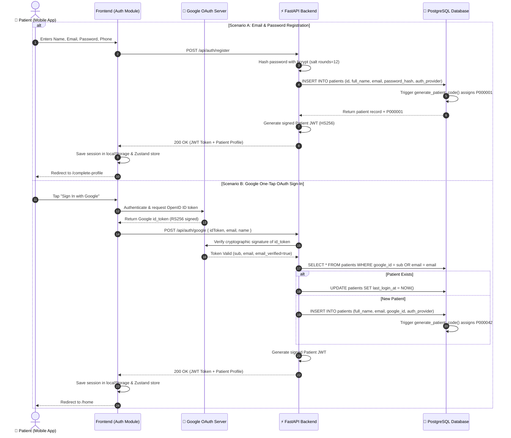

---

## 7.2 Appointment Booking Flow

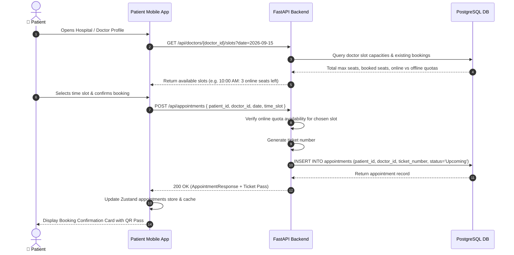

---

## 7.3 Patient Arrival, Check-In & Unified Queue Ordering

CarePulse uses a **scheduled-priority hybrid queue algorithm**. Arrived scheduled patients take precedence, interleaved with walk-ins to maintain fair throughput:

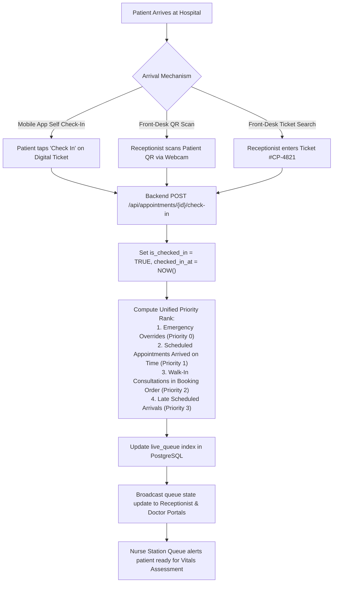

---

## 7.4 Nurse Triage & Pre-Consultation Vitals Assessment

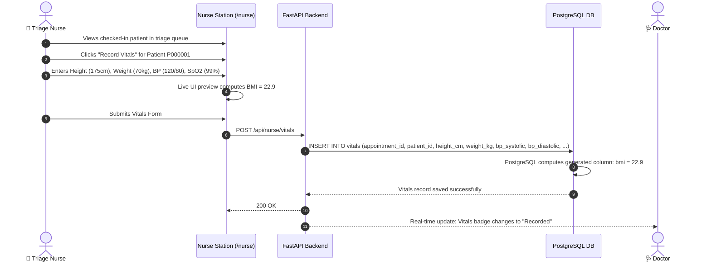

---

## 7.5 Doctor Consultation & Structured Prescription Creation

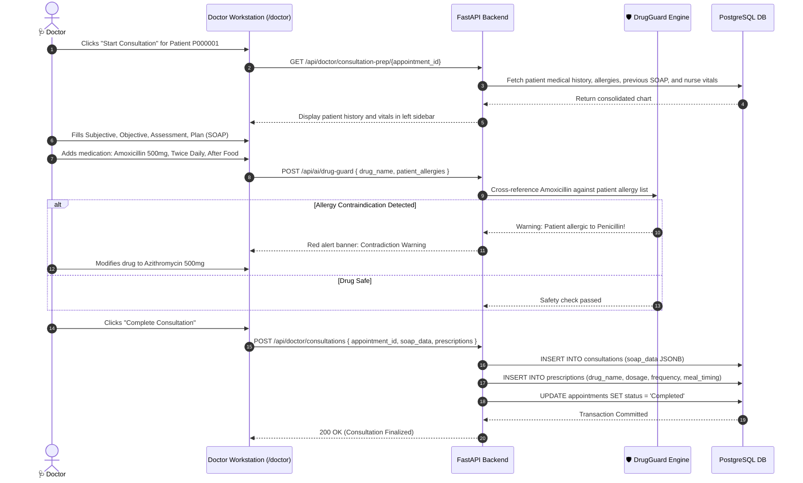

---

## 7.6 Real-Time Prescription Sync Back to Patient Mobile App

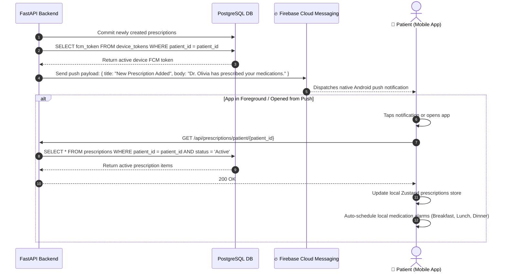

---

## 7.7 Push Notification Delivery Pipeline

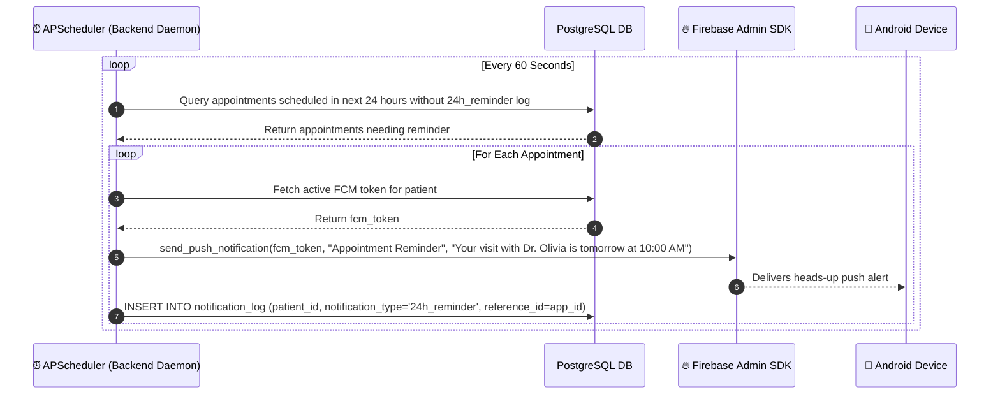

---

## 7.8 Scan Medicine Packaging Safety Verification

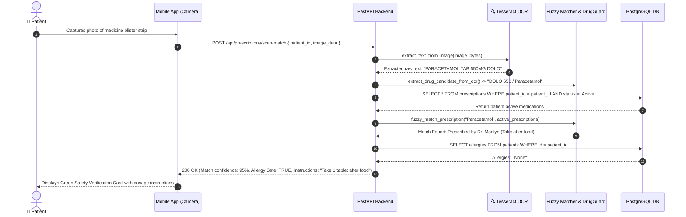

---

## 7.9 Medicine Information Lookup (Autocomplete + OpenFDA)

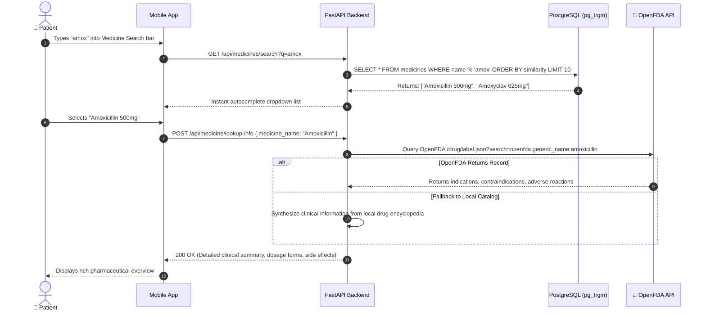

---

## 7.10 In-App APK Update System

```mermaid
sequenceDiagram
    autonumber
    actor Patient as 📱 Patient
    participant App as Android Mobile App
    participant Backend as FastAPI Backend
    participant Installer as 📦 Android OS Package Installer

    App->>Backend: On app resume: GET /api/app/version
    Backend-->>App: 200 OK { version: "1.3.0", apk_url: "/downloads/CarePulse_App.apk", notes: "Bug fixes & new features" }
    App->>App: Compares active version (e.g. 1.2.0) with server version (1.3.0)
    alt Update Available
        App-->>Patient: Displays non-dismissible UpdateAvailableModal
        Patient->>App: Clicks "Download & Install Update"
        App->>Backend: GET /downloads/CarePulse_App.apk
        Backend-->>App: Stream fresh APK file to local Android download storage
        App->>Installer: Invoke @capacitor-community/file-opener with APK URI
        Installer-->>Patient: Displays standard Android native "Update Application" prompt
        Patient->>Installer: Confirms install; app reloads with new version
    end
```

---

## 7.11 Offline / Online Dual-Store Sync & Conflict Resolution

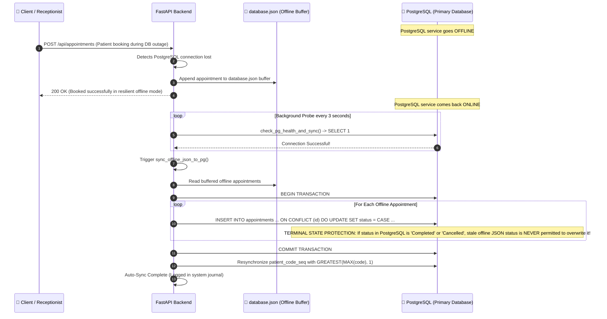

---

## 7.12 SuperAdmin -> Admin -> Receptionist -> Doctor/Nurse Account Creation Hierarchy

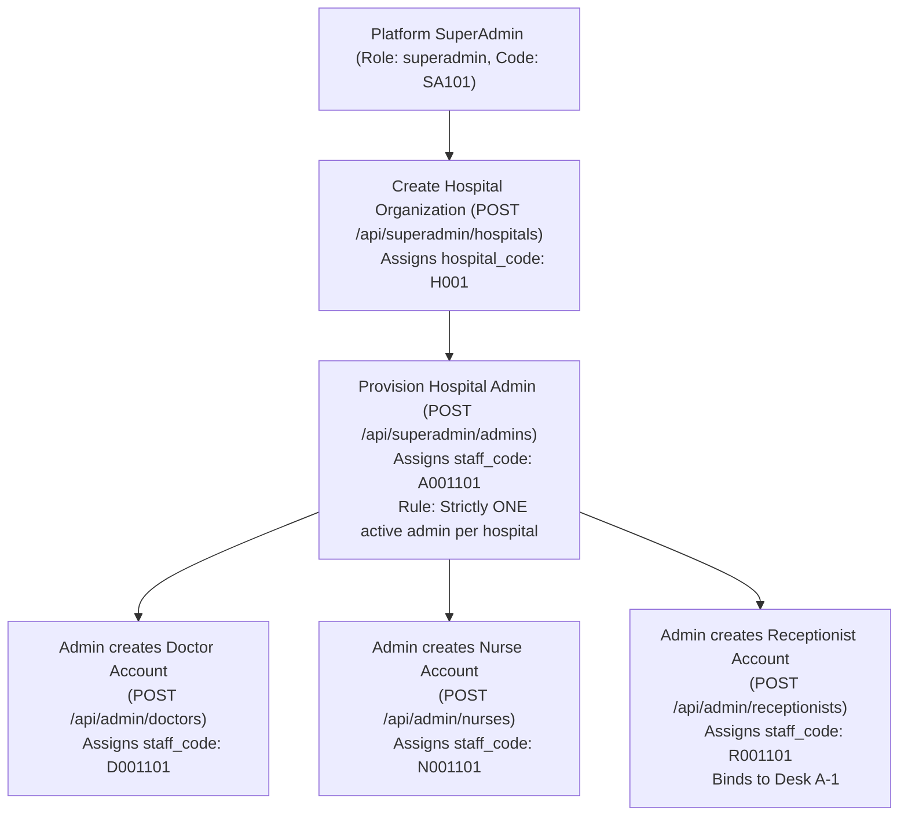
