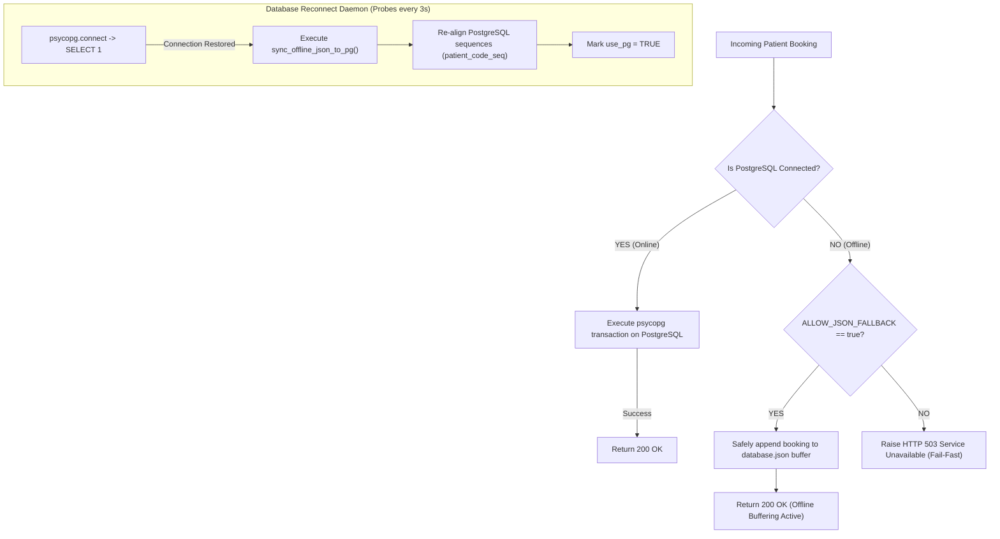

# 🛡️ CarePulse — Security, Data Integrity & Fault-Tolerance Architecture

> **Document Version:** 1.0.0  
> **Classification:** Security Specification & Resilient Systems Architecture  
> **Last Updated:** 2026-09-10  
> **Scope:** Full-Stack Cryptography, Role-Based Access Control, Tenant Isolation, and Fail-Safe Database Recovery

---

## 8.1 Cryptographic Password Security & Key Derivation

### 1. Salting & Hash Derivation (bcrypt)
All local staff and patient passwords are encrypted using `bcrypt` (work factor rounds = 12) inside `backend/core/security.py`:
- Passwords are never stored in plaintext or reversible encryption.
- Each password receives a unique, cryptographically random 128-bit salt generated via OS entropy (`os.urandom`), mitigating pre-computed rainbow table attacks.
- Passwords exceeding 72 bytes are pre-hashed with SHA-256 before bcrypt key derivation to respect Blowfish input bounds without truncating user entropy.

```python
# Verified implementation in backend/core/security.py
def hash_password(password: str) -> str:
    salt = bcrypt.gensalt(rounds=12)
    return bcrypt.hashpw(password.encode("utf-8"), salt).decode("utf-8")
```

### 2. Legacy Hash Upgrade Protection (`needs_rehash`)
The system implements automated work factor detection. If an older password hash was derived with fewer rounds (e.g. rounds < 12) or legacy SHA-256, the backend automatically flags it during successful login via `needs_rehash(hash_str)` and re-encrypts it with modern parameters on the fly.

---

## 8.2 Stateless JWT Authentication & Role-Based Access Control (RBAC)

### 1. JWT Claims & Cryptographic Signature
CarePulse issues stateless HS256-signed JSON Web Tokens (`PyJWT`) containing strictly validated payload claims:
- **Patient Tokens (`generate_patient_jwt`):**
  ```json
  {
    "sub": "a1b2c3d4-e5f6-7a8b-9c0d-1e2f3a4b5c6d",
    "email": "sarah.j@carepulse.com",
    "type": "patient",
    "exp": 1789012345
  }
  ```
- **Staff Tokens (`create_staff_access_token`):**
  ```json
  {
    "sub": "9f8e7d6c-5b4a-3f2e-1d0c-9b8a7f6e5d4c",
    "email": "dr.olivia@carepulse.com",
    "role": "doctor",
    "hospital_id": "hosp-1",
    "staff_code": "D001101",
    "exp": 1789012345
  }
  ```

### 2. Role-Based Access Control Matrix

| Endpoint Router | Permitted Roles | Unauthorized Action Response |
| :--- | :--- | :--- |
| `/api/doctor/*` | `doctor` | `403 Forbidden: Doctor access required` |
| `/api/nurse/*` | `nurse`, `admin` | `403 Forbidden: Nurse access required` |
| `/api/receptionist/*`| `receptionist`, `admin` | `403 Forbidden: Receptionist access required` |
| `/api/admin/*` | `admin`, `superadmin` | `403 Forbidden: Administrator privileges required` |
| `/api/superadmin/*` | `superadmin` | `403 Forbidden: SuperAdmin global authority required` |
| `/api/patients/*` | Authenticated Patient (Matching ID) | `401 Unauthorized / 403 Forbidden` |

---

## 8.3 Multi-Hospital Tenant Data Isolation

In a multi-facility healthcare deployment, cross-hospital data leakage represents a catastrophic regulatory and safety violation. CarePulse guarantees absolute tenant boundary enforcement at both the API layer and the physical SQL layer:

```
[ Incoming Request with Staff JWT ]
                │
                ▼
      Extract hospital_id from Token
                │
                ▼
   Is User a Global SuperAdmin?
         │                │
      YES│                │NO (Hospital Staff)
         ▼                ▼
  Allow Global Query   Inject: WHERE hospital_id = token.hospital_id
```

### 1. Mandatory Hospital Scoping in Queries
In `admin_routes.py`, `doctor_routes.py`, and `receptionist_routes.py`, the query generator automatically injects the tenant filter:
```python
effective_hosp_id = staff_ctx.get("hospital_id")
cur.execute("SELECT * FROM doctors WHERE hospital_id = %s", (effective_hosp_id,))
```
Even if an administrator maliciously passes `?hospital_id=hosp-2` in the query parameter, the backend overrides it with the immutable `hospital_id` extracted directly from the verified JWT cryptographic signature.

### 2. Verified Test Coverage
Multi-hospital isolation is verified by automated test suites:
- `backend/tests/test_appointment_isolation.py`
- `tests/staff/test_hospital_isolation.py`

---

## 8.4 Fail-Fast Database Resilience & Auto-Recovery Architecture

CarePulse implements a dual-store fail-fast architecture (`backend/database.py`) designed to prevent silent data corruption while maintaining emergency outpatient admissions during database dropouts:



### 1. Explicit Fail-Fast Configuration
By default, `ALLOW_JSON_FALLBACK` is set to `False` in production code to prevent silent database degradation. In field clinics with unstable power, administrators opt-in via `.env` (`ALLOW_JSON_FALLBACK=true`), enabling the local JSON buffer.

### 2. Auto-Recovery Daemon
When PostgreSQL resumes listening on port 5432, `check_pg_health_and_sync()` detects the connection within 3 seconds, runs any pending DDL migrations, and executes `sync_offline_json_to_pg()` without requiring a server restart.

---

## 8.5 Offline-Sync Conflict Resolution (Terminal State Protection)

When offline bookings are synchronized from `database.json` to PostgreSQL, synchronization conflicts can occur if an appointment was updated in the cloud while a client was offline. CarePulse implements **Terminal State Protection** via a prioritized SQL `CASE` statement inside `sync_offline_json_to_pg()`:

```sql
INSERT INTO appointments (id, patient_id, ticket_number, doctor_id, date, status, is_checked_in, checked_in_at)
VALUES (%s, %s, %s, %s, %s, %s, %s, %s)
ON CONFLICT (id) DO UPDATE SET
    status = CASE
        -- 1. Terminal statuses in PostgreSQL are NEVER overwritten by stale offline JSON
        WHEN appointments.status IN ('Completed', 'Cancelled') THEN appointments.status
        -- 2. Offline terminal actions (e.g. cancelled offline by receptionist) are accepted
        WHEN EXCLUDED.status IN ('Completed', 'Cancelled') THEN EXCLUDED.status
        -- 3. Active consultation in PostgreSQL is protected against earlier queue states
        WHEN appointments.status = 'In Consultation' AND EXCLUDED.status NOT IN ('Completed', 'Cancelled') THEN appointments.status
        -- 4. Checked in status in PostgreSQL is protected against earlier upcoming states
        WHEN appointments.status IN ('Checked In', 'Waiting') AND EXCLUDED.status IN ('Upcoming', 'Confirmed', 'Pending') THEN appointments.status
        ELSE EXCLUDED.status
    END,
    is_checked_in = (appointments.is_checked_in OR EXCLUDED.is_checked_in),
    checked_in_at = COALESCE(appointments.checked_in_at, EXCLUDED.checked_in_at);
```

### State Precedence Order:
$$\text{Completed / Cancelled (Terminal)} > \text{In Consultation} > \text{Checked In / Waiting} > \text{Upcoming / Confirmed}$$

---

## 8.6 Sequence Synchronization & Primary Key Collision Prevention

When offline records with pre-assigned codes are synced into PostgreSQL, primary database auto-increment sequences could fall behind the maximum synced value, leading to collision errors on subsequent online registrations.

To eliminate this vulnerability, `sync_offline_json_to_pg()` executes dynamic sequence realignment:
```sql
SELECT setval('patient_code_seq', GREATEST(
    (SELECT COALESCE(MAX(SUBSTRING(patient_code FROM 2)::BIGINT), 0) 
     FROM patients 
     WHERE patient_code ~ '^P[0-9]+$'),
    1
), true);
```
Subsequent online registrations are guaranteed to generate sequence values strictly greater than any synced offline code.

---

## 8.7 Hierarchical Display Code Constraints & One-Admin Rule

### 1. Hierarchical Staff Code Generation
Staff display codes enforce physical structural provenance:
$$\text{Code} = \langle \text{Role Letter} \rangle + \langle \text{3-digit Hospital Code} \rangle + \langle \text{3-digit Sequence Starting at 101} \rangle$$
- Role Letters: `'A'` (Admin), `'D'` (Doctor), `'R'` (Receptionist), `'N'` (Nurse).
- For Hospital 1 (`H001`): First Doctor = `D001101`, Second Doctor = `D001102`, First Nurse = `N001101`.
- SuperAdmin is globally scoped: `SA101`, `SA102`.

### 2. One-Admin-Per-Hospital Integrity Constraint
To eliminate competing executive authorities within a single facility, PostgreSQL enforces a partial unique index:
```sql
CREATE UNIQUE INDEX idx_one_active_admin_per_hospital 
ON staff (hospital_id) 
WHERE role = 'admin' AND is_active = true;
```
Any attempt by a SuperAdmin or script to provision a second active administrator for the same hospital causes the database engine to immediately throw an `IntegrityError` and abort the transaction.
