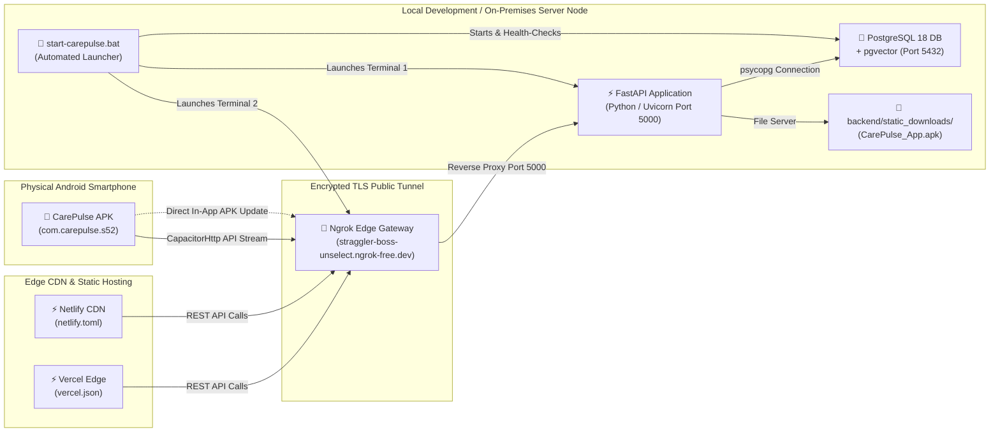
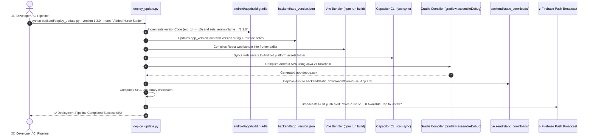

# 🚀 CarePulse — Deployment, Infrastructure & DevOps Operations Manual

> **Document Version:** 1.0.0  
> **Classification:** Infrastructure Engineering & Deployment Operations Guide  
> **Last Updated:** 2026-09-10  
> **Scope:** Full Environment Setup, Automated Scripts, Cloud Hosting, Tunneling, and Android Mobile Distribution

---

## 10.1 System Environment & Infrastructure Topology



---

## 10.2 Service Execution Modes & Startup Scripts

### Mode 1: Production Android Network Services (`start-carepulse.bat`)
This launcher orchestrates the entire backend and public tunnel required to run the physical Android APK. It executes three automated steps:
1. **Step 1 (Port Check & Database Health):** Probes port 5432. If PostgreSQL is stopped, it automatically invokes `net start postgresql-x64-18` (or generic Windows service fallback) and waits for port 5432 to bind.
2. **Step 2 (FastAPI Backend):** Launches `python backend/main.py` in Terminal Window 1, binding to `0.0.0.0:5000`.
3. **Step 3 (Ngrok Encrypted Tunnel):** Waits 4 seconds for FastAPI to stabilize, then launches Terminal Window 2 running:
   ```cmd
   ngrok http 5000 --domain=straggler-boss-unselect.ngrok-free.dev
   ```

```cmd
:: To start Android production network services:
E:\S5_Mini_Project\start-carepulse.bat
```

### Mode 2: Local Web Development (`start-carepulse-dev.bat`)
Used when developing both web frontend and backend simultaneously on the local machine:
- **Terminal 1:** Starts FastAPI Backend on `http://localhost:5000`.
- **Terminal 2:** Starts Vite Dev Server on `http://localhost:5173` (`npm --prefix frontend run dev`).

```cmd
:: To start local development environment:
E:\S5_Mini_Project\start-carepulse-dev.bat
```

### Mode 3: Clean Service Termination (`stop-carepulse.bat`)
Gracefully terminates all running instances of Python (port 5000), Ngrok, and Vite dev servers without requiring manual task manager intervention:

```cmd
:: To cleanly stop all CarePulse services:
E:\S5_Mini_Project\stop-carepulse.bat
```

---

## 10.3 Database Provisioning & Schema Migration

### Local PostgreSQL Installation (Windows Native)
- **Port:** `5432`
- **Default Database:** `carepulse`
- **User:** `postgres`
- **Extensions Required:** `pgvector`, `pg_trgm`

### Automated Schema Migration
The database schema is self-provisioning. Upon server startup, `backend/database.py` executes `run_db_migrations()` using `database/init.sql`, automatically creating all 16 tables, 5 views, and triggers idempotently (`CREATE TABLE IF NOT EXISTS`).

### Docker Alternative (`docker-compose.yml`)
For Linux servers or containerized local execution:
```yaml
version: '3.8'
services:
  db:
    image: pgvector/pgvector:pg16
    container_name: carepulse_postgres
    restart: always
    environment:
      POSTGRES_USER: postgres
      POSTGRES_PASSWORD: password123
      POSTGRES_DB: carepulse
    ports:
      - "5432:5432"
    volumes:
      - ./database/init.sql:/docker-entrypoint-initdb.d/init.sql
      - pgdata:/var/lib/postgresql/data

volumes:
  pgdata:
```
- **Start:** `docker-compose up -d`
- **Stop:** `docker-compose down`

---

## 10.4 Web Cloud Deployment (Netlify / Vercel)

The React web application is configured for continuous zero-config deployment to edge hosting providers.

### 1. Netlify Configuration (`frontend/netlify.toml`)
```toml
[build]
  command = "npm run build"
  publish = "dist"

[[redirects]]
  from = "/*"
  to = "/index.html"
  status = 200
```
- **Purpose:** Ensures client-side React Router (`/doctor`, `/receptionist`, `/home`) handles deep page refreshes without triggering HTTP 404 errors.

### 2. Vercel Configuration (`frontend/vercel.json`)
```json
{
  "rewrites": [
    { "source": "/(.*)", "destination": "/index.html" }
  ]
}
```

---

## 10.5 Android Mobile App Distribution & In-App Update Pipeline

CarePulse features a fully automated build, compilation, and over-the-air (OTA) in-app update delivery pipeline managed by `backend/deploy_update.py`.



### Complete Update Deployment Commands:
```bash
# Option A: Explicit version bump with custom release notes
python backend/deploy_update.py --version 1.3.0 --notes "Enhanced Nurse Vitals Station and instant prescription sync."

# Option B: Automated patch version bump (e.g. 1.2.0 -> 1.2.1)
python backend/deploy_update.py --bump patch

# Option C: Standalone push notification broadcast to all active devices
python backend/broadcast_update.py
```

### Binary Verification & Security
The deployment script automatically prints:
- **Binary Path:** `backend/static_downloads/CarePulse_App.apk`
- **File Size:** ~16 MB
- **SHA-256 Digest:** Verified against package manifest
- **Public Download URL:** `https://straggler-boss-unselect.ngrok-free.dev/downloads/CarePulse_App.apk`
